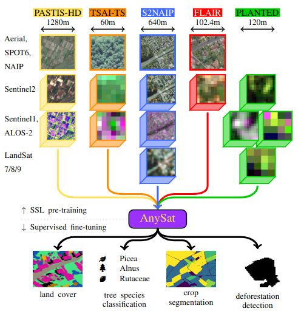
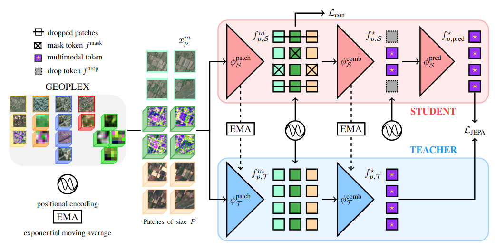
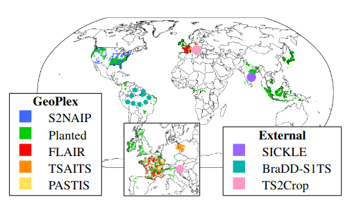

# AnySat: One Earth Observation Model for Many Resolutions, Scales, and Modalities (CVPR 2025 Highlight)

[](https://github.com/pre-commit/pre-commit)
[](https://pytorch.org/get-started/locally/)
[](https://pytorchlightning.ai/)
[](https://hydra.cc/)
[](https://github.com/ashleve/lightning-hydra-template#license)

[//]: # ([![Paper]&#40;https://img.shields.io/badge/paper-arxiv.1001.2234-B31B1B.svg&#41;]&#40;https://www.nature.com/articles/nature14539&#41;)
[//]: # ([![Conference]&#40;https://img.shields.io/badge/AnyConference-year-4b44ce.svg&#41;]&#40;https://papers.nips.cc/paper/2020&#41;)


Official implementation for
<br>
<br>
[_AnySat: An Earth Observation Model for Any Resolutions, Scales, and Modalities_](https://arxiv.org/abs/2412.14123)
<br>

<p align="center">
  
</p>


# Abstract

**AnySat** is a versatile Earth Observation model designed to handle diverse data across resolutions, scales, and modalities. Using a **scale-adaptive joint embedding predictive architecture** (JEPA), AnySat can train in a self-supervised manner on highly heterogeneous datasets.

We train a single AnySat model on **GeoPlex**, a collection of 5 multimodal datasets spanning 11 sensors with varying characteristics. In fine-tuning or linear probing, AnySat achieves SOTA or near-SOTA performance for land cover segmentation, crop type classification, change detection, tree species identification, and flood mapping.

<p align="center">
  
</p>

# Key Features
- 🌍 **Versatile Model**:Handles diverse datasets with resolutions spanning **3–11 channels**, tiles ranging from **0.3 to 2600 hectares**, and any combination of **11 sensors**.
- 🚀 **Simple to Use**: Install and download AnySat with a single line of code, select your desired modalities and patch size, and immediately generate rich features.
- 🦋 **Flexible Task Adaptation**: Supports fine-tuning and linear probing for tasks like **tile-wise classification** and **semantic segmentation**.
- 🧑‍🎓 **Multi-dataset Training**: Trains a single model across multiple datasets with varying characteristics.


# 🚀  Quickstart

Check out our [demo notebook](demo.ipynb) or [huggingface page](https://huggingface.co/g-astruc/AnySat) for more details.

## Install and load Anysat

```python

import torch

AnySat = torch.hub.load('gastruc/anysat', 'anysat', pretrained=True, flash_attn=False)

```
Set `flash_attn=True` if you have [flash-attn](https://pypi.org/project/flash-attn/) module installed. It is not required and only impacts memory and speed.

## Format your data

Arrange your data in a dictionary with any of the following keys:

| Dataset       | Description                       | Tensor Size                                          | Channels                                  | Resolution |
|---------------|-----------------------------------|-----------------------------------------|-------------------------------------------|------------|
| aerial        | Single date tensor |Bx4xHxW                                              | RGB, NiR                                  | 0.2m       |
| aerial-flair  | Single date tensor |Bx5xHxW                                              | RGB, NiR, Elevation                       | 0.2m       |
| spot          | Single date tensor |Bx3xHxW                                              | RGB                                       | 1m         |
| naip          | Single date tensor |Bx4xHxW                                              | RGB                                       | 1.25m      |
| s2            | Time series tensor |BxTx10xHxW                                           | B2, B3, B4, B5, B6, B7, B8, B8a, B11, B12 | 10m        |
| s1-asc        | Time series tensor |BxTx2xHxW                                            | VV, VH                                    | 10m        |
| s1            | Time series tensor |BxTx3xHxW                                            | VV, VH, Ratio                             | 10m        |
| alos          | Time series tensor |BxTx3xHxW                                            | HH, HV, Ratio                             | 30m        |
| l7            | Time series tensor |BxTx6xHxW                                            | B1, B2, B3, B4, B5, B7                    | 30m        |
| l8            | Time series tensor |BxTx11xHxW                                           | B8, B1, B2, B3, B4, B5, B6, B7, B9, B10, B11 | 10m     |
| modis         | Time series tensor |BxTx7xHxW                                            | B1, B2, B3, B4, B5, B6, B7                | 250m       |
   
Note that time series requires a `_dates` companion tensor containing the day of the year: 01/01 = 0, 31/12=364. The data also needs to be normalized (data -mean) /std as input to our model.

**Example Input** for a tile of 60x60m and a batch size of B:

```python
data = {
    "aerial": ... #Tensor of size [B, 4, 300, 300] : 4 channels, 300x300 pixels at 20cm res
    "spot": ... #Tensor of size [B, 3, 60, 60]: 3 channels, 60x60 pixels at 1m res
    "s2": ... #Tensor of size [B, 12, 10, 6, 6] : 12 dates, 10 channels, 6x6 pixels at 10m res
    "s2_dates":  ... #Tensor of size [B, 12] : 12 dates
}
```
Ensure that the spatial extent of each modality multiplied by its resolution is consistent.

## Extract Features

Decide on:
- **Patch size** (in m, must be a multiple of 10): adjust according to the scale of your tiles and GPU memory. In general, avoid having more than 1024 patches per tile.
- **Output type**: Choose between:
  - `'tile'`: Single vector per tile
  - `'patch'`: A vector per patch
  - `'dense'`: A vector per sub-patch
  - `'all'`: A vector per patch with class token at first position

⚠️ For segmentation tasks, use 'dense' argument!

The sub patches are `1x1` pixels for time series and `10x10` pixels for VHR images. If using `output='dense'`, specify the `output_modality`.

Example use:
```python
features = AnySat(data, patch_size=10, output='tile') #tensor of size [B, D,]
features = AnySat(data, patch_size=10, output='patch') #tensor of size [B, D, 6, 6]
features = AnySat(data, patch_size=20, output='patch') #tensor of size [B, D, 3, 3]
features = AnySat(data, patch_size=20, output='dense', output_modality='aerial') #tensor of size [B, 2*D, 30, 30]
features = AnySat(data, patch_size=20, output='dense', output_modality='s2') #tensor of size [B, 2*D, 6, 6]
```
**Explanation for the size of the dense map:** `d=10` for 'aerial' which has a 0.2m resolution, the sub-patches are 2x2 m.

# Advanced Installation

## Install from source

```bash
# clone project
git clone https://github.com/gastruc/anysat
cd anysat

# [OPTIONAL] create conda environment
conda create -n anysat python=3.9
conda activate anysat

# install requirements
pip install -r requirements.txt

# Create data folder where you can put your datasets
mkdir data
# Create logs folder
mkdir logs
```

## Run Locally

To load the model locally, you can use the following code:
```python

from hubconf import AnySat

AnySat = AnySat.from_pretrained('base', flash_attn=False) #Set flash_attn=True if you have flash-attn module installed
#For now, only base is available.
#device = "cuda" If you want to run on GPU default is cpu
```

Every experience of the paper has its config file. Feel free to explore `configs/exp` folder.

```bash
# Run AnySat pretraining on GeoPlex
python src/train.py exp=GeoPlex_AnySAT

# Run AnySat finetuning on BraDD-S1TS
python src/train.py exp=BraDD_AnySAT_FT

# Run AnySat linear probing on BraDD-S1TS
python src/train.py exp=BraDD_AnySAT_LP
```

# Supported Datasets

Our implementation already supports 9 datasets:

<p align="center">
  
</p>

## GeoPlex Datasets

1. **TreeSatAI-TS**
   - **Description**: Multimodal dataset for tree species identification.
   - **Extent**: 50,381 tiles covering 180 km² with multi-label annotations across 20 classes.
   - **Modalities**: VHR images (0.2 m), Sentinel-2 time series, Sentinel-1 time series.
   - **Tasks**: Tree species classification.

2. **PASTIS-HD**
   - **Description**: Crop mapping dataset with delineated agricultural parcels.
   - **Extent**: 2,433 tiles covering 3986 km² with annotations across 18 crop types.
   - **Modalities**: SPOT6/7 VHR imagery (1.5 m), Sentinel-2 time series, Sentinel-1 time series.
   - **Tasks**: Classification, semantic segmentation, panoptic segmentation.

3. **FLAIR**
   - **Description**: Land cover dataset combining VHR aerial imagery with Sentinel-2 time series.
   - **Extent**: 77,762 tiles covering 815 km² with annotations across 13 land cover classes.
   - **Modalities**: VHR images (0.2 m), Sentinel-2 time series.
   - **Tasks**: Land cover mapping.

4. **PLANTED**
   - **Description**: Global forest dataset for tree species identification.
   - **Extent**: 1,346,662 tiles covering 33,120 km² with annotations across 40 classes.
   - **Modalities**: Sentinel-2, Landsat-7, MODIS, Sentinel-1, ALOS-2.
   - **Tasks**: Tree species classification.

5. **S2NAIP-URBAN**
   - **Description**: Urban dataset with high-resolution imagery and time series data.
   - **Extent**: 515,270 tiles covering 211,063 km² with NAIP, Sentinel-2, Sentinel-1, and Landsat-8/9 data.
   - **Modalities**: NAIP (1.25 m), Sentinel-2 time series, Sentinel-1 time series, Landsat-8/9.
   - **Tasks**: Pretraining only (no official labels).

## External Evaluation Datasets

1. **BraDD-S1TS**
   - **Description**: Change detection dataset for deforestation in the Amazon rainforest.
   - **Extent**: 13,234 tiles with Sentinel-1 time series.
   - **Tasks**: Change detection (deforestation segmentation).

2. **SICKLE**
   - **Description**: Multimodal crop mapping dataset from India.
   - **Extent**: 34,848 tiles with Sentinel-1, Sentinel-2, and Landsat-8 time series.
   - **Tasks**: Crop type classification (paddy/non-paddy).

3. **TimeSen2Crop**
   - **Description**: Crop mapping dataset from Slovenia.
   - **Extent**: 1,212,224 single-pixel Sentinel-2 time series.
   - **Tasks**: Crop type classification.
  
4. **Sen1Flood11**
   - **Description**: Flood mapping dataset with global scope.
   - **Extent**: 4.8K Sentinel-1/2 time series.
   - **Tasks**: Flood classification (flooded/ not flooded).
  
# Reference

Please use the following bibtex:
```bibtex
@article{astruc2024anysat,
  title={{AnySat: An Earth} Observation Model for Any Resolutions, Scales, and Modalities},
  author={Astruc, Guillaume and Gonthier, Nicolas and Mallet, Clement and Landrieu, Loic},
  journal={arXiv preprint arXiv:2412.14123},
  year={2024}
}
```

# Acknowledgements
- The code is conducted on the same base as [OmniSat](https://github.com/gastruc/OmniSat)
- The JEPA implementation comes from [JEPA](https://github.com/facebookresearch/ijepa)
- The code from Pangaea datasets comes from [Pangaea](https://github.com/VMarsocci/pangaea-bench)
<br>
